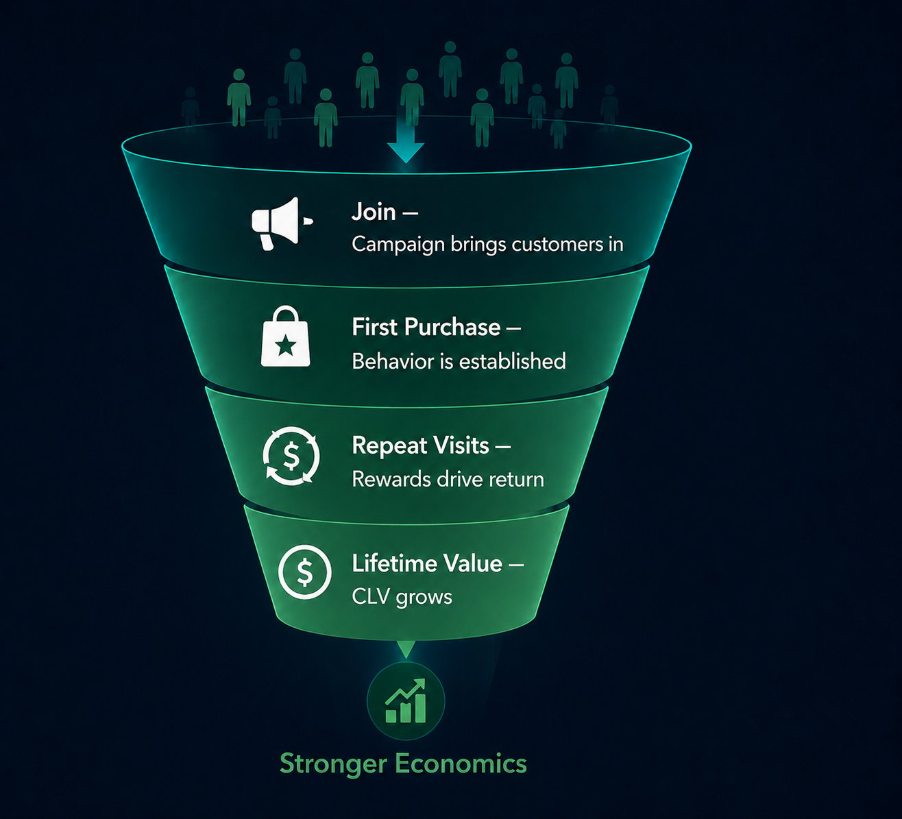

## 01 A funnel connects ad clicks to real customer value

### What is a marketing funnel?

A funnel describes the journey a customer takes — from first seeing your ad to becoming a loyal, repeat buyer. At each stage, some people drop off, just like water leaking through a funnel.

### The five stages

1. **Reach** — Your ad is shown to a qualified audience
2. **Click** — Someone clicks the ad, signaling interest
3. **Activate** — The user experiences the product's value for the first time (e.g. completes sign-up, tries a feature)
4. **Purchase** — The user pays, turning interest into revenue
5. **Retain** — The user comes back again and again, building long-term value (also called CLV — Customer Lifetime Value, the total revenue one customer brings over time)

---

## 02 The click problem: activity can look like growth

### Why top-of-funnel metrics can mislead

Top-of-funnel means the early stages — the metrics you see first, like clicks.

- High **CTR** (Click-Through Rate) or low **CPC** (Cost Per Click) can make a campaign *look* efficient, even when most clicks never turn into real customers.
- Traffic can increase while retention (customers who keep coming back) and payback (recovering your ad spend) remain poor.
- The biggest leak isn't always visible at the top — compare each stage's drop-off against past data or benchmarks to find it.

### The key question shift

- Clicks answer: **Who reacted?**
- Funnel analysis answers: **Who activated, retained, and created value?**

---

## 03 Real example: Starbucks Rewards as a customer-value funnel

::: {.columns}
::: {.column width="55%"}
{width=100%}
:::
::: {.column width="45%"}

::: {style="text-align:center; background:rgba(255,255,255,0.07); border-radius:10px; padding:0.6em 0.5em; margin-bottom:0.5em;"}
**33.8M**

U.S. 90-day active Rewards members (Q4 FY2024)
:::

::: {style="text-align:center; background:rgba(255,255,255,0.07); border-radius:10px; padding:0.6em 0.5em; margin-bottom:0.5em;"}
**+4%**

Year-over-year membership growth in Q4 FY2024
:::

::: {style="text-align:center; background:rgba(255,255,255,0.07); border-radius:10px; padding:0.6em 0.5em; margin-bottom:0.5em;"}
**$36.2B**

FY2024 consolidated net revenue
:::

::: {style="font-size:0.5em; opacity:0.6; text-align:center;"}
*Source: Starbucks Q4 FY2024 results and FY2024 annual report.*
:::

:::
:::

---

## 04 Decision example: the best lever may not be more ads

### Illustrative funnel math

| Stage | Users | Drop-off |
|---|---:|---:|
| Clicks | 100,000 | — |
| Sign-ups | 12,000 | −88% |
| Activated | 8,160 | −32% |
| First purchases | 3,753 | −54% |
| Retained | 3,003 | −20% |

**Strategic options:**

1. **Sign-up conversion:** Simplify registration and align ad copy with the landing page to reduce the drop-off from clicks to sign-ups.
2. **First purchase conversion:** After activation, introduce conversion nudges — first-order discounts, limited-time offers, or personalized recommendations.

*A/B testing across both stages helps identify which approach drives the best results.*

---

## 05 Takeaway: optimize for customer equity, not campaign activity

1. Clicks are a signal, not the destination.
2. Rank bottlenecks by value loss — find the stage where the most revenue is escaping, not just the stage with the most visible drop.

::: {.callout-tip appearance="simple"}
The best marketers do not stop at "what converted?"  
They ask: **"what created customers worth keeping?"**
:::
